#  SLAM 多点导航功能包

## navi_multi_goals_pub_rviz_plugin


### 描述：

该功能包为SLAM 建图导航提供可发布多个目标点任务的导航方式。

### 要求:

必须基于 Autolabor SLAM导航使用

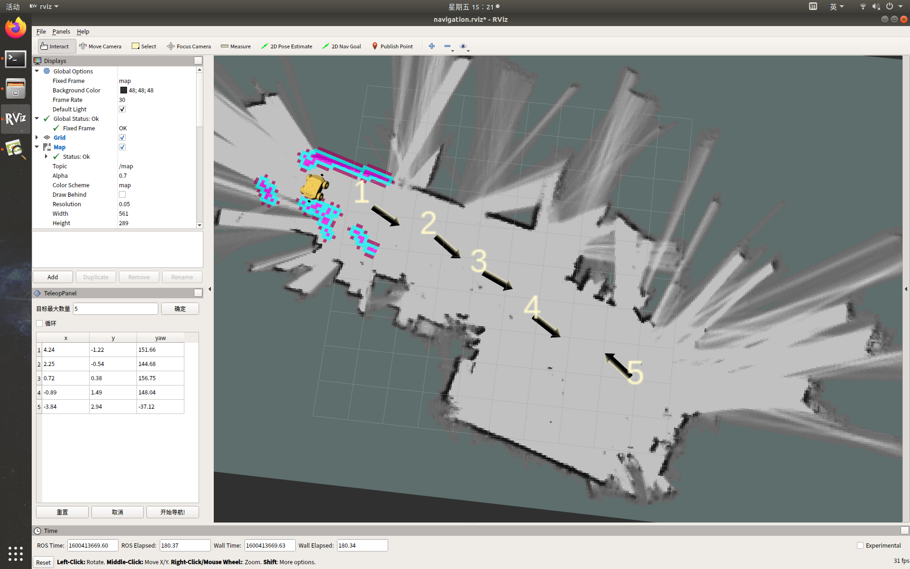


### 一、安装与配置


#### 1. 下载程序包

进入 /home/autolabor/catkin_ws/src 目录，执行

```
git clone https://github.com/autolaborcenter/rviz_navi_multi_goals_pub_plugin.git
```

或访问 https://github.com/autolaborcenter/rviz_navi_multi_goals_pub_plugin.git 下载源代码，放入 /home/autolabor/catkin_ws/src 目录中

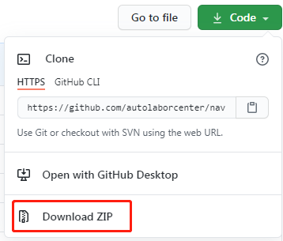

给新加入的文件添加操作权限，在/home/autolabor/catkin_ws 目录下，右键打开终端，执行

`sudo chmod -R 777 /home/autolabor/catkin_ws/src/`

输入密码 `autolabor`，回车

#### 2. 编译

还是在 /home/autolabor/catkin_ws 目录下，终端执行

`sudo rm -rf build/ devel/ logs/ .catkin_tools/`

输入密码 `autolabor`，回车，然后执行

`catkin build`

#### 3. 编译完成后，启动【开始导航】

**注：要求提前建好地图。**

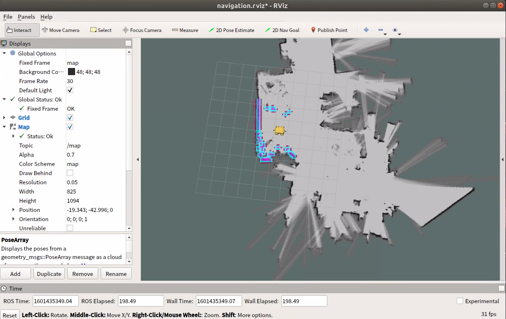

#### 4. 加载插件

RViz 的左上角依次点击 Panels -> Add New Panel -> navi_multi_goals_pub_rviz_plugin -> MultiNaviGoalsPanel 

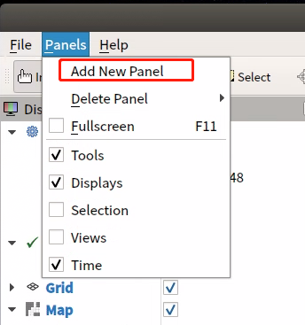
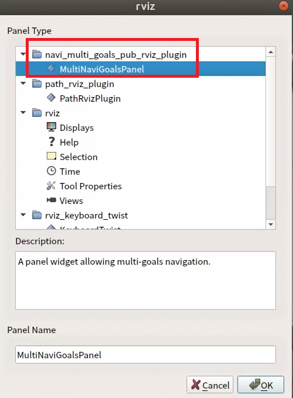
<div style="clear: both;"></div>

***

**加载完毕：**


#### 5. 修改配置

##### 1) 新增 marker （目标点标记）

RViz 左侧 Display -> add -> Marker

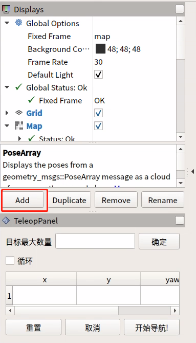
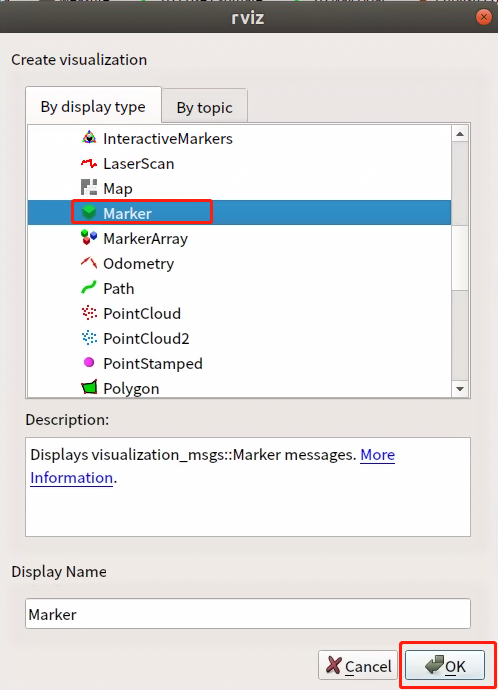
<div style="clear: both;"></div>

***

##### 2) 修改 2D Nav Goal 按钮话题

RViz 的左上角 Panels->Add New Panel-> Tool Property

将 2D Nav Goal -> Topic 修改为 /move_base_simple/goal_temp 

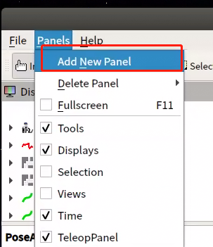

<div style="clear: both;"></div>

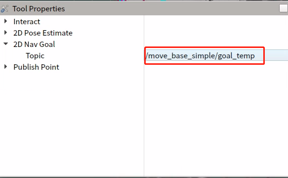

***

**做完以上操作后 Ctrl  + S 保存 RViz 配置，如忘记保存，则下次进来要重复操作。**


### 二、使用

### 操作区说明

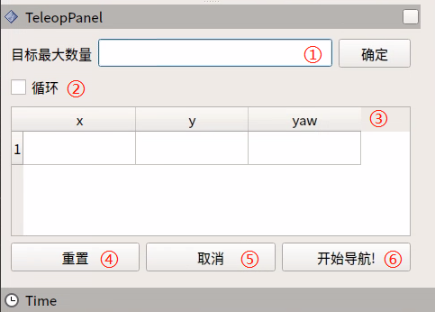

① 可设置目标点的最大数量：要求所设置目标点个数不能大于该参数（可以小于）

② 是否循环：若勾选，导航至最后一个目标点后，将重新导航至第一个目标点。例：1->2->3->1->2->3->···，该选项必须在开始导航前勾选

③ 任务目标点列表： x/y/yaw，地图上给定目标点的位姿（xy坐标与航向角yaw)。

* 设置完目标最大数量，保存后，该列表会生成对应数量的条目
* 每给出一个目标点，此处会读取到目标点的坐标与朝向

④ 重置：将清空当前所有目标点

⑤ 取消：取消当前目标点导航任务，机器人停止运动。再次点击开始导航后，会从下一个任务点开始。

例：1->2->3，在1->2的过程中点击取消，机器人停止运动，点击开始导航后，机器人将从当前坐标点去往3。

⑥ 开始导航：开始任务

### 操作步骤说明

#### 1. 初始化机器人位置

点击开始导航，打开 rviz，使用键盘控制机器人运动，当环境特征与地图匹配完成后，机器人会定位到地图中对应的位置。

#### 2. 设置任务

##### 1) 设置任务目标点个数，点击确认保存

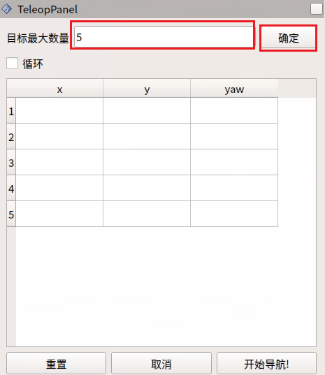


##### 2) 设置目标点

点击ToolBar上的2D Nav Goal，在地图上给定目标点。（每次设置都需要先点击2D Nav Goal）

目标点有朝向区分，箭头顶端为车头方向。

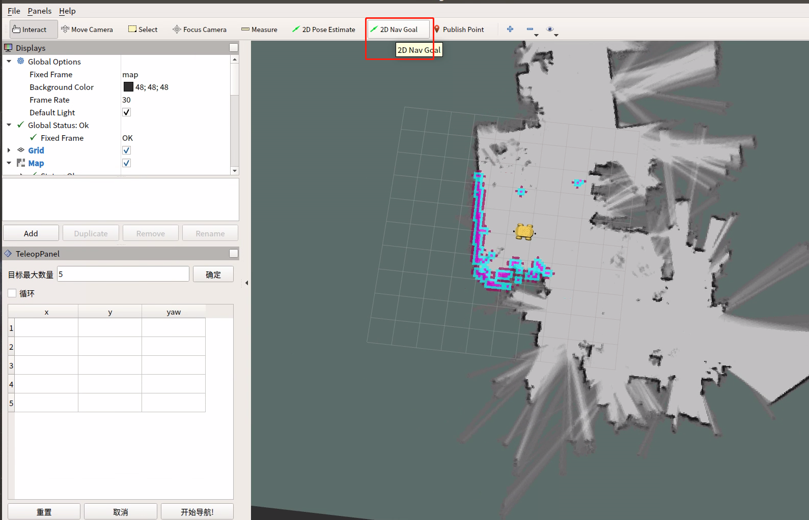

##### 3) 点击开始导航，导航开始

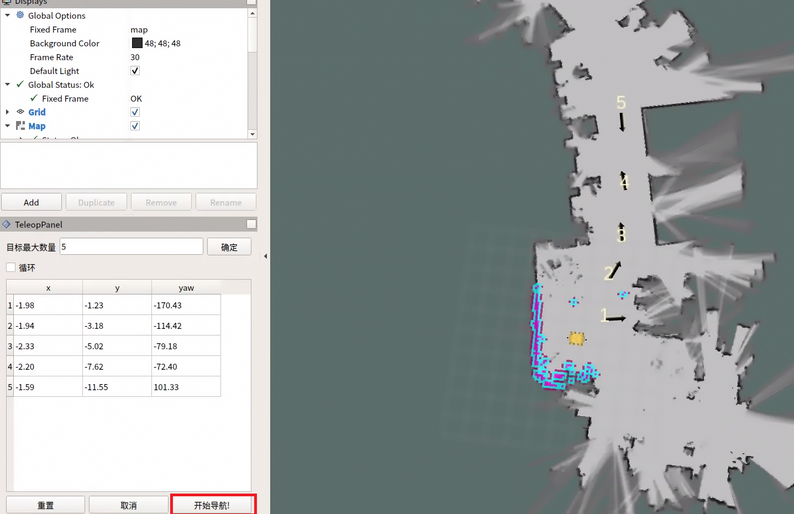


已完成任务会变为红色（如下图）

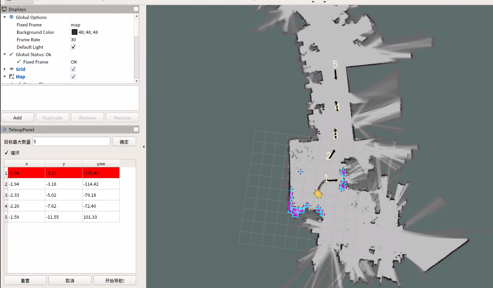


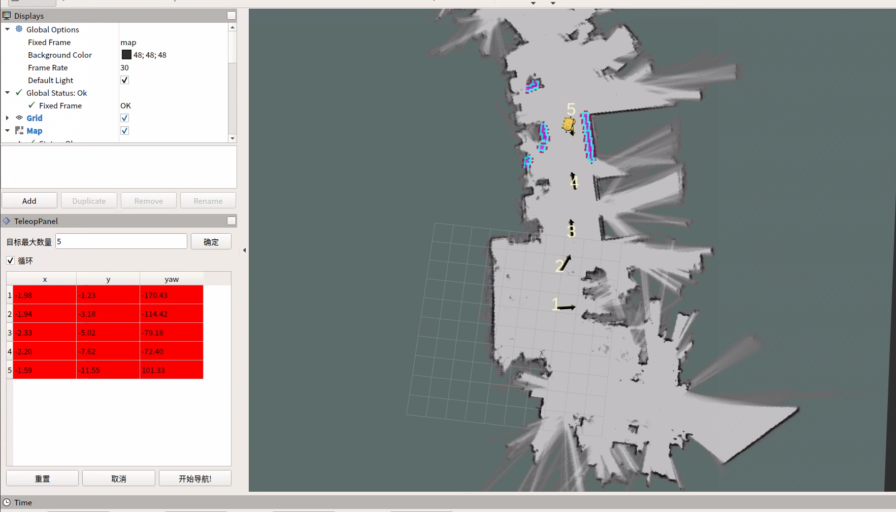


未勾选循环，单次任务完成后停止。

勾选循环，单次任务完成后，会从最后一个目标点到第一个目标点，显示颜色为蓝色。


